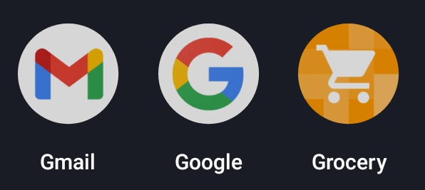
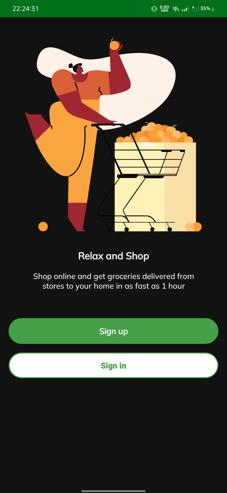
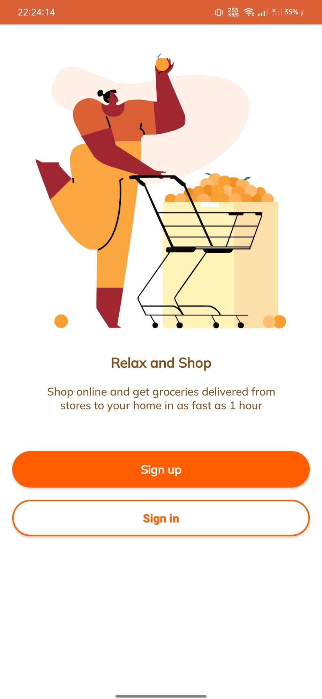
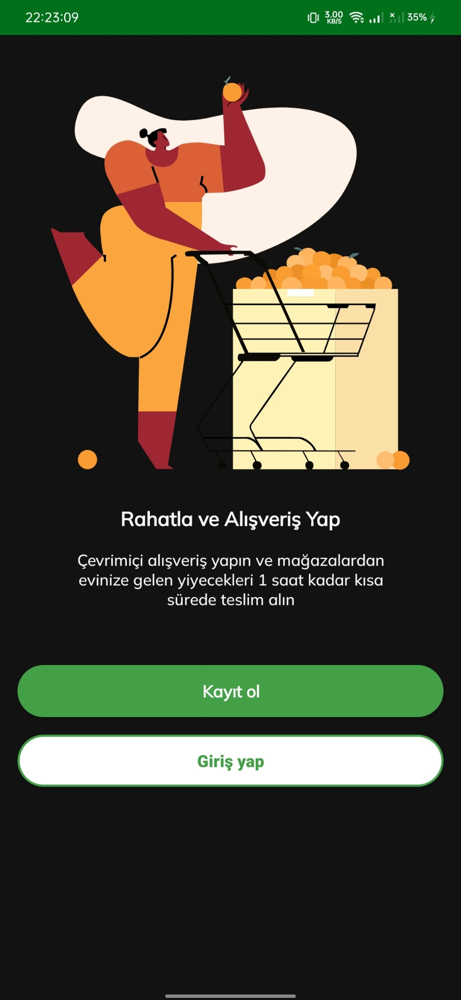
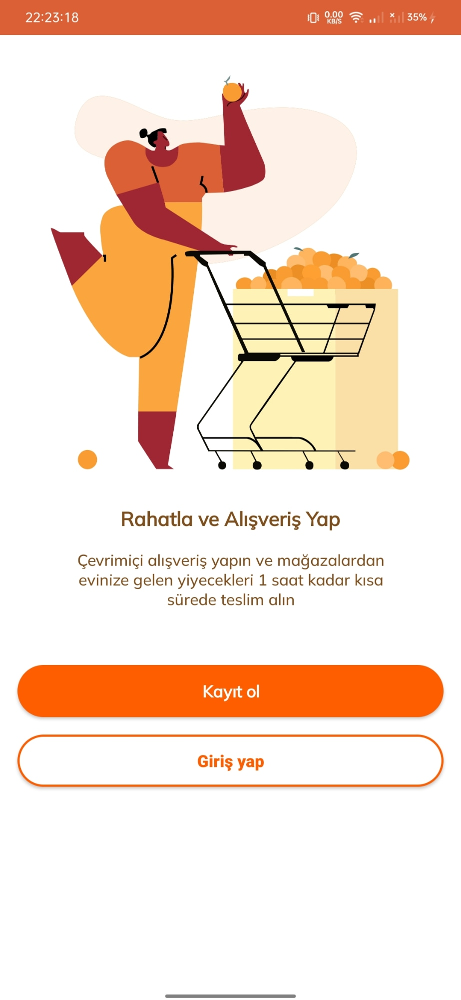

Uygulama içindeki kullanılan custom font: Mulish Medium
- https://fonts.google.com/specimen/Mulish

Figma üzerinden kendi hesabıma kopyaladığım tasarım (tasarım başkasına aittir)
- https://www.figma.com/file/1rMHA6Jhy6lCAFjPPSC5Fn/Grocery-app-(Community)?node-id=0%3A1

### Ekran Görüntüleri

#### Uygulama iconu

#### İngilizce - Koyu mod

#### İngilizce - Açık mod

#### Türkçe - Koyu mod

#### Türkçe - Açık mod

